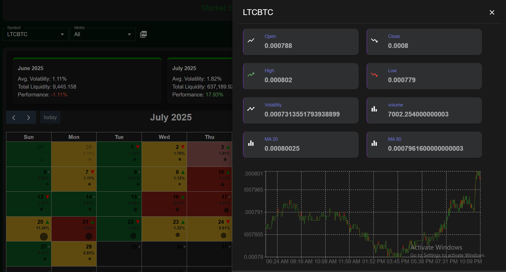

# Market Seasonality Explorer

A React-based dashboard for visualizing cryptocurrency seasonality and order book data with interactive calendar and in-depth analytics.

## Features

- **Dynamic Symbol Selection**: Choose from a variety of trading pairs (e.g., BTCUSDT, ETHBTC) with live data fetched from Binance.
- **Metric Filtering**: Toggle between various metrics—All, Volatility, Liquidity, Performance—to color calendar cells and update visual cues.
- **Interactive Calendar**: Explore daily, weekly, and monthly crypto data using FullCalendar with custom cell content, metric highlights, and tooltips.
- **Order Book Snapshot**: Displays live top bids and asks for the selected symbol. Data refreshes automatically every 5 seconds.
- **Detailed Drawer View**: Click any calendar day for a right-side drawer with in-depth statistics (open, close, high, low, volatility, volume) and a price chart.
- **Volatility Coloring**: Calendar cells use color-coding to represent volatility; low = green, medium = yellow, high = red.
- **Liquidity Visuals**: Liquidity is represented by circle size and cell overlays.
- **Performance Icons**: Up/Down/Neutral arrows in calendar cells for quick performance sense.
- **Weekly/Monthly Aggregation**: Sidebar/summary for weekly/monthly data aggregated from daily points.
- **Volume Chart**: Side panel includes a responsive chart for volume trends.
- **PDF Export**: Download the entire dashboard view as a PDF via a single click.

## Components Structure

| Component           | Description                                                                                              |
|---------------------|----------------------------------------------------------------------------------------------------------|
| `Dashboard`         | Main container; symbol/metric selection, PDF export, order book fetching, and CalendarComponent wrapper. |
| `CalendarComponent` | FullCalendar integration, data aggregation (day/week/month), custom rendering, detail fetch, drawer.     |
| `SideDashboard`     | Shown in drawer on date click; displays key stats and intraday price chart.                              |
| `OrderBook`         | (Import expected) Renders order book (top bids/asks) as a card in the dashboard.                         |
| `VolumeChart`       | (Import expected) Plots aggregated volume trend for week/month.                                          |
| `WeeklyComponent`   | (Import expected) Shows week-level stats summary.                                                        |
| `MonthlyComponent`  | (Import expected) Summarizes calendar data on a monthly basis.                                           |
| `CalendarLegend`    | (Import expected) Color/shape legend for calendar metric cues.                                           |
| `SideDashboard`     | (Drawer) Detailed OHLC values, volume, volatility, and line chart.                                       |

## Tech Stack

- **Frontend:** React, Material UI, FullCalendar.js, recharts, axios
- **Data:** Binance public REST API
- **Utilities:** html2canvas, jsPDF (for PDF export), mathjs (for statistics/aggregation)
- **Styling:** Custom CSS modules (e.g., component.css, calender.css)

## Setup & Installation

1. **Install dependencies:**
- npm install

2. **Project structure:**
- Ensure you have the following files/folders:
  - `Dashboard/` with `component.css` and `Dashboard.js`
  - `Calender/` with `calender.css`, `CalenderComponent.js`, and expected child components (OrderBook.js, WeeklyComponent.js, etc.)
  - `Charts/` with `VolumeChart.js`
  - `services/api.js` with named endpoints for symbol and order book fetching.

3. **Start the development server:**
- npm start

## Usage

- Select a trading pair (symbol) and metric of interest.
- View order book summary and aggregated volume stats.
- Hover over calendar days for metric tooltips.
- Click any day for detailed OHLC chart and analytics.
- Switch between Month/Week modes in the calendar header.
- Export the dashboard as a PDF for sharing.

## Notable APIs & Utilities

- **Binance API:** Used for live symbols, order books, and candlestick (kline) data.
- **html2canvas/jsPDF:** Capture styled dashboard state and enable PDF download.
- **mathjs:** Calculate volatility (std dev), moving averages, and aggregates.

## Screenshots

> 
> 
> 

## Customization & Extensibility

- Extend `api.js` for more endpoints (e.g., historical or aggregated metrics).
- Add more metrics or visual layers in calendar or detail drawer.
- Enhance styling or localization using Material UI and CSS modules.

## License

MIT License. See [LICENSE](./LICENSE) for more information.

**Built for exploring market seasonality and liquidity patterns across major cryptocurrencies, with a focus on user insight and interactivity.**
